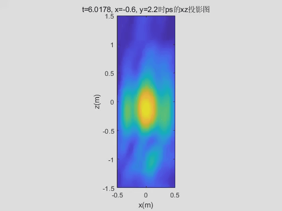
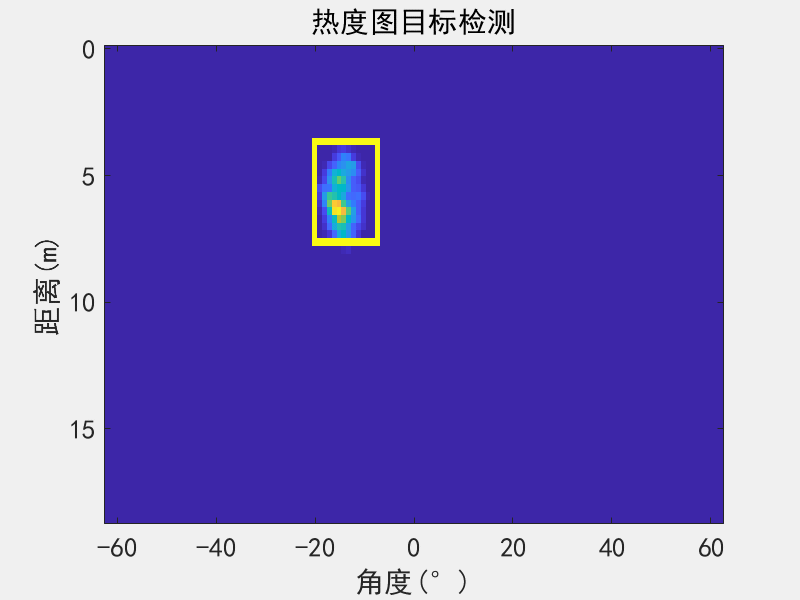

---
## Introduction

This project is a work of team of 3, which includes [hsuhaoo](https://github.com/hsuhaoo) and [Zijing Guan](/). We were luckily supported and guided by [Prof. Jie Zhuang](https://faculty.uestc.edu.cn/zhuangjie/en/index.htm). The project can be further extended to applications like fall detection for the elderly.

The radar works in the 2.7 GHz - 3.7 GHz band, and has 4 transmitting antennas and 12 receive antennas. With the power of less than 10 dBm, it can measure the distance of a person with a median of 5 cm. Within 5 meters, it has an positioning accuracy of about 20 cm. Without further tests, the maximum distance is unknown. However, it can indicate the existance of a person behind a 25 cm concrete wall.

Code and documents are available [here](https://github.com/pidan1231239/fmcw_positioning_radar). Slides introducing hardware and data processing process (in Chinese) are available [here](https://sway.com/5uSW86N1bUqbrA7T?ref=Link).

### FMCW

> Frequency-modulated continuous-wave radar (FM-CW) – also called continuous-wave frequency-modulated (CWFM) radar – is a short-range measuring radar set capable of determining distance ([Continuous-wave radar wiki](https://en.wikipedia.org/wiki/Continuous-wave_radar)). 

If you have no idea about FMCW, the following tutorials can be a good starting point.

- [Frequency-Modulated Continuous-Wave Radar](http://www.radartutorial.eu/02.basics/Frequency%20Modulated%20Continuous%20Wave%20Radar.en.html) ([FMCW Radar](http://www.radartutorial.eu/02.basics/Frequency%20Modulated%20Continuous%20Wave%20Radar.en.html)): a brief introduction of the principle of FMCW
- [Build a Small Radar System Capable of Sensing Range, Doppler, and Synthetic Aperture Radar Imaging](https://ocw.mit.edu/resources/res-ll-003-build-a-small-radar-system-capable-of-sensing-range-doppler-and-synthetic-aperture-radar-imaging-january-iap-2011/index.htm): an MIT course to build an FMCW radar yourself
- [GUEST POST: TRY RADAR FOR YOUR NEXT PROJECT](https://hackaday.com/2014/02/24/guest-post-try-radar-for-your-next-project/): an article written by the instructor of the course above
- [Intro to mmWave Sensing: FMCW Radars - Module 1: Range Estimation](https://training.ti.com/intro-mmwave-sensing-fmcw-radars-module-1-range-estimation): a series of 5 short videos  providing a concise yet in-depth introduction to sensing using FMCW radars

### SDR

> [Software-defined radio](https://en.wikipedia.org/wiki/Software-defined_radio) (SDR) is a radio communication system where components that have been traditionally implemented in hardware (e.g. mixers, filters, amplifiers, modulators/demodulators, detectors, etc.) are instead implemented by means of software on a personal computer or embedded system.

We use a USRP N210 with an LFRX daughter board to sample the baseband signal. The RF front end is made with RF modules and the FMCW generator is build on a VCO. The USRP here acts as an ADC and is connected to Simulink. Following links show how to connect a USRP to Simulink:

- [USRP® Support Package from Communications System Toolbox](https://ww2.mathworks.cn/hardware-support/usrp.html?s_tid=srchtitle): Matlab toolbox for USRP
- [Digital Communication Systems Engineering Using Software Defined Radio](http://ecewp.ece.wpi.edu/wordpress/wireless/textbooks/sdrlabs/): a tutorial of SDR using Simulink

---
## Hardware

In this section, we introduce the hardware design in two parts, i.e. RF front end and FMCW generator. We refer to the following projects and papers for basic ideas:

- [Build a Small Radar System Capable of Sensing Range, Doppler, and Synthetic Aperture Radar Imaging](https://ocw.mit.edu/resources/res-ll-003-build-a-small-radar-system-capable-of-sensing-range-doppler-and-synthetic-aperture-radar-imaging-january-iap-2011/index.htm)
- [RF-Capture](http://rfcapture.csail.mit.edu/): [paper see RF-Capture: Capturing a Coarse Human Figure Through a Wall](http://rfcapture.csail.mit.edu/rfcapture-paper.pdf)
- [WiTrack](http://witrack.csail.mit.edu/): papers see [3D Tracking via Body Radio Reflections](http://witrack.csail.mit.edu/witrack-paper.pdf), [Multi-Person Localization via RF Body Reflections](http://witrack.csail.mit.edu/witrack2-paper.pdf)

### FMCW generator

Hardware:

- [ADF4159](http://www.analog.com/en/products/clock-and-timing/phase-locked-loop/fractional-n-pll/adf4159.html) evaluation board: [EV-ADF4159EB3Z](http://www.analog.com/en/design-center/evaluation-hardware-and-software/evaluation-boards-kits/eval-adf4159.html)
- Loop filter: [AD8065](http://www.analog.com/cn/products/amplifiers/operational-amplifiers/jfet-input-amplifiers/ad8065.html). It is designed with [ADIsimPLL](https://form.analog.com/Form_Pages/RFComms/ADISimPll.aspx) under the guidance of [CN-0302](http://www.analog.com/media/en/reference-design-documentation/reference-designs/CN0302.pdf).
- VCO: [ZX95-3800A+](https://www.minicircuits.com/WebStore/modelSearch.html?model=ZX95-3800A%2B)
- Power splitter: [ZX10-2-42+](https://www.minicircuits.com/WebStore/modelSearch.html?model=ZX10-2-42%2B)
- Attenuator: [VAT-3+](https://www.minicircuits.com/WebStore/modelSearch.html?model=VAT-3%2B)

Our FMCW generator works in 2.7GHz-3.7GHz band to avoid 2.4GHz wifi signal.



### RF front end

Hardware:

- PA and LNA: [ZX60-53LNB+](https://www.minicircuits.com/WebStore/modelSearch.html?model=ZX60-53LNB%2B)
- Power splitter: [ZN2PD-9G+](https://www.minicircuits.com/WebStore/modelSearch.html?model=ZN2PD-9G%2B)
- Attenuator: [FW-9+](https://www.minicircuits.com/WebStore/modelSearch.html?model=FW-9%2B)
- Mixer: [ZX05-43+](https://www.minicircuits.com/WebStore/modelSearch.html?model=ZX05-43%2B)
- Switch: ADRF5040
- mbed board: ST NUCLEO-L476RG

The mbed board detects the trigger edge and add a digital signal after the edge to indicate id of antenna pair. The baseband signal from the mixer and the sync signal from mbed board are first sampled with the LFRX daughter board simultaneously, then analyzed with Simulink in real time.



---
## Software

In this section, we introduce software design in three parts, i.e. ADF4159 evaluation board configuration, mbed code, and Simulink model. 

### ADF4159

The ADF4159 evaluation board is configured using [ADF4158 and ADF4159 Evaluation Board Software](http://www.analog.com/media/en/evaluation-boards-kits/evaluation-software/ADF4158-9_Setup_v4_10_6.zip) via USB. The configuration file is available [here](https://github.com/pidan1231239/fmcw_positioning_radar/tree/master/ad4159). The board is configured with follow parameters:

- Ramp mode: Continuous sawtooth
- RF frequency: 2.7 GHz - 3.7 GHz
- Ramp frequency: 2000 Hz
- Charge pump: 1.25 mA
- Muxout: Digital lock Detection. It is used as a trigger to switch antenna pairs and a sync signal to align base band signals of each antenna pair. The *muxout* port outputs a falling edge on the start of a ramp.

The 4 Tx and 12 Rx antennas makes up 4*12 antenna pairs. With ramp frequency of 2000 Hz, every antenna pair can be activated for 41.7 times per second.

### mbed code

The mbed board switches antenna pairs after every trigger edge from the ADF4159 Muxout pin. And as mentioned before, it adds a digital signal after the edge to indicate id of antenna pair. Considering that MCU is running at a relatively low frequency, which makes the responce to the sync signal unstable, we design the digital signal from MCU to pull down the sync signal after the trigger edge. In this way, the falling edge is kept synced. Code of mbed board is available [here](https://github.com/pidan1231239/fmcw_positioning_radar/tree/master/mcu).



### Simulink model

All the models are in the [simulink](https://github.com/pidan1231239/fmcw_positioning_radar/tree/master/simulink) folder. [RadarImagingAndPositioning.slx](https://github.com/pidan1231239/fmcw_positioning_radar/blob/master/simulink/RadarImagingAndPositioning.slx) block process baseband signals from USRP and output the 2D heat map and target position. The data processing pipeline is shown in the slides mentioned before. [usrp_4t12r_heatmap.slx](https://github.com/pidan1231239/fmcw_positioning_radar/blob/master/simulink/usrp_4t12r_heatmap.slx) cooperates the above block with others to show the imaging and target detection results.

---
## Results

In the experimental stage, A system with only 1 Tx and 3 Rx is built for experimental usage.



The sync signal is shown below.



Waterfall plot of each antenna pair is shown below. A person is walking away then back in this experiment. The d axis shows the round trip of the radar signal.



The system is then expanded to 1 Tx and 8 Rx, which allows 2D imaging with phased array algorithm.



The image bellow shows the heat map captured from the 1Tx8Rx system. The x-axis indicates angle from left to right. The y-axis indicates the round distance of the radar signal. A person is standing in front of the radar at a distance of about 4 meters in this case.



The system is further expanded to 4 Tx and 12 Rx, which allows 3D imaging.



The following GIF is the 3D imaging projected to the front view, showing a person drawing a circle in the air with a corner reflector.

<figure>
  
  <figcaption>Front view heatmap</figcaption>
</figure>

The GIF below shows the 2D imaging from above with target detection activated. A person is walking around in the distance of about 3 meters. The y-axis indicates the round distance of radar signal.

<figure>
  
  <figcaption>Top-down view heatmap</figcaption>
</figure>

We tried to extract the signal strength vertical axis of person target doing squatting in the 10th second. However, as the radio waves in this frequency acts more like mirror reflection on the human body, the angle of the reflection surface becomes a issue as mentioned in [RF-Capture](http://rfcapture.csail.mit.edu/). This makes the height of a person unpredictable for our system. 

The figure bellow shows the strength of the reflected signal in the vertical axis vs time. The heat map indicates that the height of the person drops several times during the first 10 seconds, while the target only moves slightly with no changes on height.



The final work was put together on a cart.


